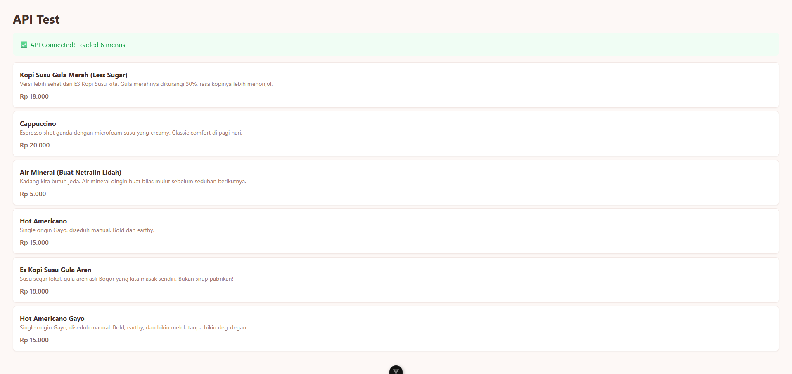

# ☕ Stand Coffee OS (MVP)

> *"Bukan sekadar aplikasi kasir. Ini adalah Sistem Operasi buat stand kopi biar owner-nya bisa fokus nyeduh dan ngobrol, sementara sistem yang ngurusin antrean dan catat duit."*

**🔗 Live Demo & Progress:** [github.com/fransalwan/coffee-stand](https://github.com/fransalwan/coffee-stand)

---

## 🧠 Filosofi & Latar Belakang

Project ini dibangun dengan prinsip **"Scratch Your Own Itch"** dan **"Via Negativa"** (menambah nilai dengan mengurangi friksi). 

Banyak sistem kasir/POS di luar sana yang ribet, penuh *dark patterns*, dan bikin pusing owner stand kopi yang margin-nya tipis. **Stand Coffee OS** dibangun dengan tujuan:

1. **Peace of Mind buat Owner:** Dashboard yang cuma nunjukin 3 angka ajaib (Omzet, Cup Terjual, Stok Kritis). Nggak ada grafik yang bikin pusing.
2. **Frictionless buat Customer:** Menu "Jujur" (ada *storytelling* bahan baku) dan fitur *Skip The Queue* (Pre-order via WA).
3. **Habit Building:** Sistem stempel digital yang ngunci kebiasaan pelanggan tanpa perlu kartu fisik yang gampang ilang.

### 🎯 Mission
**Democratize access to good tools.** Siapa aja yang punya mimpi buka stand kopi harusnya bisa mulai tanpa ribet dan tanpa keluar duit jutaan buat sistem.

---

## 🚀 Progress & Status

### ✅ Completed (Phase 1-2)
- [x] Backend API dengan Go + Gin + Postgres
- [x] Database schema dengan price_snapshot untuk akurasi laporan
- [x] Auto-migrate & seeder dengan data dummy "Menu Jujur"
- [x] CRUD Menu API (Public & Admin routes)
- [x] Customer management via WhatsApp
- [x] Order system dengan auto +1 stempel
- [x] Loyalty stamp system (redeem 10 stamps = 1 kopi gratis)
- [x] Frontend Vue 3 + TypeScript setup
- [x] Tailwind CSS dengan custom coffee color palette
- [x] API integration & fetching real-time data
- [x] WhatsApp checkout integration

### 🚧 In Progress (Phase 3)
- [ ] Cart system & order management UI
- [ ] Owner Dashboard (input order, manage stamps)
- [ ] Dashboard stats (omzet harian, top menu)
- [ ] Deploy to production (Railway + Vercel)

### 📋 Planned (Phase 4+)
- [ ] JWT authentication untuk admin
- [ ] Background jobs (daily report, low-stock alerts)
- [ ] Multi-branch support
- [ ] WA Gateway integration (auto-reply)

---

## 🛠 Tech Stack

Kita pakai *stack* yang *bulletproof*, cepet, dan *low-resource* (biar nggak bakar duit server di fase awal).

### Backend
- **Language:** Golang 1.21+ (Concurrent, cepat, low memory footprint)
- **Framework:** Gin (Lightweight HTTP router)
- **ORM:** GORM (Untuk kecepatan development MVP)
- **Database:** PostgreSQL 14+ (Relational, ACID-compliant)

### Frontend
- **Framework:** Vue 3 (Composition API) + TypeScript
- **State Management:** Pinia
- **Styling:** Tailwind CSS v3 (Mobile-first, utility-first)
- **HTTP Client:** Axios
- **Build Tool:** Vite

### Deployment (Planned)
- **Backend:** Railway / Fly.io
- **Frontend:** Vercel / Cloudflare Pages
- **Database:** Neon / Supabase

---

##  Struktur Project

```text
coffee-stand/
├── backend/
│   ├── cmd/
│   │   └── main.go              # Entry point & routing
│   ├── internal/
│   │   ├── database/
│   │   │   ├── database.go      # Koneksi Postgres & Auto-migrate
│   │   │   └── seeder.go        # Isi data dummy "Menu Jujur"
│   │   ├── handlers/            # Logic HTTP (Controllers)
│   │   │   ├── menu_handler.go
│   │   │   ├── customer_handler.go
│   │   │   ├── order_handler.go
│   │   │   └── stamp_handler.go
│   │   └── models/              # Struct Database (GORM Models)
│   │       ├── menu.go
│   │       ├── customer.go
│   │       ├── order.go
│   │       └── stamp_log.go
│   ├── .env.example
│   ├── go.mod
│   └── README.md
│
├── frontend/
│   ├── src/
│   │   ├── assets/
│   │   ├── components/
│   │   │   ├── MenuCard.vue
│   │   │   └── CartBottomSheet.vue
│   │   ├── services/
│   │   │   └── api.ts
│   │   ├── stores/
│   │   │   └── cart.ts
│   │   ├── types/
│   │   │   └── index.ts
│   │   ├── views/
│   │   │   └── CustomerView.vue
│   │   ├── App.vue
│   │   └── main.ts
│   ├── .env
│   ├── tailwind.config.js
│   └── package.json
│
└── README.md
---

## 🗄️ Database Schema

### Core Tables

**menu_items** - Katalog produk dengan "Menu Jujur"
- `id`, `name`, `description` (storytelling bahan baku)
- `price` (integer, rupiah), `is_available`
- `created_at`, `updated_at`

**customers** - Identitas pelanggan via WhatsApp
- `phone_number` (PK, format: 628xxx)
- `name`, `total_stamps` (cache untuk performa)
- `created_at`

**orders** - Header transaksi
- `id`, `customer_phone` (FK)
- `total_amount`, `payment_method` (cash/qris/transfer)
- `status` (pending/completed/cancelled)
- `created_at`

**order_items** - Detail transaksi dengan price_snapshot
- `id`, `order_id` (FK), `menu_item_id` (FK)
- `quantity`, `price_snapshot` (HARGA SAAT TRANSAKSI - crucial!)
- `created_at`

**stamp_logs** - Audit trail loyalty
- `id`, `customer_phone` (FK)
- `change_amount` (+1 atau -10)
- `reason` (purchase/redeem_reward/manual_adjustment)
- `created_at`

### 💡 Key Design Decisions

**1. price_snapshot di order_items**
Menyimpan harga **saat transaksi terjadi**, bukan harga saat ini dari menu. Ini memastikan laporan omzet historis tetap akurat meskipun harga menu berubah di masa depan.

**2. total_stamps vs stamp_logs**
`total_stamps` di tabel `customers` adalah cache untuk performa (query cepat). `stamp_logs` adalah audit trail untuk transparansi (cek kalau ada komplain).

**3. phone_number sebagai Primary Key**
Simpel dan frictionless. Nggak perlu sistem login/register yang ribet. Identitas utama ya Nomor WhatsApp.

---

## 📡 API Endpoints

Base URL: `http://localhost:8080/api`

### Public Routes (Customer)
- `GET /menu` - Ambil semua menu yang available
- `POST /customers/register` - Register customer via WA
- `GET /customers/:phone` - Get customer info & stamps
- `GET /customers/:phone/stamps` - Get stamp history
- `POST /customers/:phone/redeem` - Redeem 10 stamps untuk kopi gratis
- `POST /orders` - Create order (auto +1 stamp)
- `GET /orders?phone=xxx` - Get order history

### Admin Routes (Owner)
- `GET /admin/menu` - Get all menus (including sold out)
- `POST /admin/menu` - Create new menu
- `PUT /admin/menu/:id` - Update menu (price, availability)
- `DELETE /admin/menu/:id` - Delete menu

---

## 🚀 Quick Start Guide

### Prerequisites
- Go 1.21+
- PostgreSQL 14+
- Node.js 18+ & npm
- Git

### Backend Setup

```bash
# 1. Clone repository
git clone https://github.com/fransalwan/coffee-stand.git
cd coffee-stand/backend

# 2. Create database
psql -U postgres
CREATE DATABASE kopi_temen_backend;
\q

# 3. Setup environment
cp .env.example .env
# Edit .env dengan kredensial database kamu

# 4. Install dependencies & run
go mod tidy
go run cmd/main.go

- Key Features & Documentation

Dokumentasi lengkap fitur-fitur utama, screenshots, cara kontribusi, dan informasi project.

---

## 🎯 Key Features

### 1. Menu "Jujur" (Storytelling)
Setiap menu punya deskripsi yang detail tentang bahan baku dan proses. Contoh:
> "Susu segar lokal, gula aren asli Bogor yang kita masak sendiri. Bukan sirup pabrikan!"

Customer tau persis apa yang mereka minum. Transparansi = trust.

**Kenapa ini penting?**
- Customer makin percaya karena tau asal-usul bahan
- Owner bisa bedain produknya dari kompetitor
- Nggak ada lagi "hidden ingredients" yang bikin customer ragu

---

### 2. WhatsApp Checkout (Frictionless)
Customer scan QR → pilih menu → klik "Pesan via WA" → teks pesanan ke-format otomatis → owner terima chat.

**Flow-nya:**
1. Customer scan QR code di stand
2. Web menu kebuka di HP customer
3. Customer pilih menu & jumlah
4. Klik "Pesan via WhatsApp"
5. Teks pesanan otomatis ke-format rapi:

6. Owner terima chat, langsung bikin kopi
7. Customer bayar di tempat (cash/QRIS)

**Kenapa nggak payment gateway?**
- Orang beli kopi itu impulsif → ribet = batal beli
- Stand kopi margin tipis → nggak perlu bayar fee payment gateway
- Cash/QRIS di tempat lebih natural buat stand kopi

---

### 3. Auto Loyalty Stamps
Setiap order otomatis +1 stempel. 10 stempel = 1 kopi gratis.

**Cara kerja:**
- Customer kasih nomor WhatsApp saat order pertama
- Sistem auto-register customer
- Setiap order completed → +1 stempel otomatis
- Customer bisa cek jumlah stempel kapan aja
- Setelah 10 stempel → bisa redeem 1 kopi gratis

**Keuntungan:**
- Nggak perlu kartu fisik yang gampang ilang
- Nggak perlu download app
- Owner bisa track customer retention
- Customer betah balik lagi

---

### 4. Audit Trail Lengkap
Setiap perubahan stempel tercatat di `stamp_logs`. Kalau ada komplain "kok stempel gue ilang?", tinggal cek log. Data nggak bohong.

**Yang dicatat:**
- Waktu perubahan stempel
- Jumlah perubahan (+1 atau -10)
- Alasan (purchase/redeem_reward/manual_adjustment)
- Nomor customer yang bersangkutan

**Contoh use case:**
Customer: "Kak, stempel saya kok cuma 8? Harusnya 10 dong, saya kan udah beli 10 kali!"

Owner: "Bentar kak, saya cek dulu..."
→ Buka dashboard → Cek stamp_logs → Ketemu 2 transaksi belum ke-input
→ Input manual → Stempel customer jadi 10
→ Customer happy, owner tenang

---

## 📸 Screenshots

### Frontend - Customer View


**Apa yang kamu liat:**
- ✅ API Connected - Backend & frontend terkoneksi
- 6 menu kopi dengan deskripsi "jujur"
- Harga yang jelas (format Rupiah)
- UI yang clean & mobile-friendly
- Warna warm (coffee palette) yang nyaman di mata

**Tech yang dipakai:**
- Vue 3 + TypeScript
- Tailwind CSS dengan custom coffee colors
- Axios untuk API calls
- Pinia untuk state management

---


## 🤝 Contributing

Project ini open-source dan dibuat untuk membantu UMKM kopi lokal. Kontribusi kamu sangat dihargai!

## 📞 Support & Contact

Punya pertanyaan? Mau kolaborasi? Atau sekadar mau ngobrol soal kopi & code?

### 💻 GitHub
- **Issues:** [github.com/fransalwan/coffee-stand/issues](https://github.com/fransalwan/coffee-stand/issues)
  - Laporkan bug
  - Request fitur baru
  - Tanya pertanyaan teknis

- **Discussions:** [github.com/fransalwan/coffee-stand/discussions](https://github.com/fransalwan/coffee-stand/discussions)
  - Share ide
  - Diskusi general
  - Show & tell

### 📱 Social Media
- **Threads:** [@fransalwan](https://threads.net/@fransalwan)
  - Update progress
  - Thread journey
  - Tech tips

- **LinkedIn:** [Frans Alwan](https://www.linkedin.com/in/frans-alwan-b304a6213/)
  - Professional updates
  - Networking

### 📧 Email
- **Email:** [fransalwan55@gmail.com](mailto:fransalwan55@gmail.com)
  - Business inquiries
  - Collaboration proposals
  - General questions


**Response Time:**
- GitHub Issues: 1-3 hari
- Email: 1-5 hari
- Social Media: 1-7 hari

---

**Last updated:** July 2026

*Built with ❤️, ☕, and lots of 💻*
